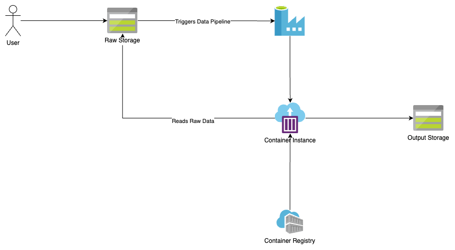

Azure Dataset Processing Pipeline
---



#### Setup

Make sure nix package manager is available on host os and run the following command to setting up the re-producible environment:

```bash
nix-shell
```

---

#### Documentation

- [Proposal](./docs/PROPOSAL.md)
- [processors](jobs/extract/README.md)
- [Y](./docs/ARCH.md)
- [Z](./docs/CHALLENGES.md)
- Jobs
    - [extract](./jobs/extract/README.md)
    - [B](./docs/ARGO.md)
    - [C](./apps/registry/mlflow/README.md)