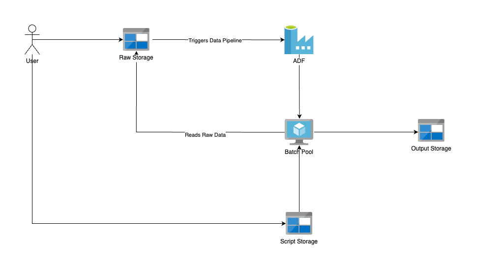

Azure Dataset Processing Pipeline
---



### Setup and deployment

Make sure nix package manager is available on host os and run the following command to setting up the re-producible environment:

```bash
nix-shell
```

it will setup local environments with Azure CLI, Python and requirements for jobs (scripts) to be tested on local.

- add required python modules to `requirements.txt` for scripts in the `scripts` directory.

#### Deployment

Steps:

- Deploy all resources to Azure
- Generate Connection string for blob account
- Copy Scripts to the `scripts` blob
- Run Pipeline

---

#### Debug

- while working on the project, I was in need to monitor steps and deubg/make sure everything is correctly set up. for further information, check commands in `Makefile` with `debug` prefix.

#### Documentation

- [Deploy](./docs/DEPLOY.md)
- Scripts
    - [extract_parquet_sas](./docs/EXTRACT_PARQUET_SAS.md)
    - [manipulate_csv](./docs/MANIPULATE_CSV.md)
